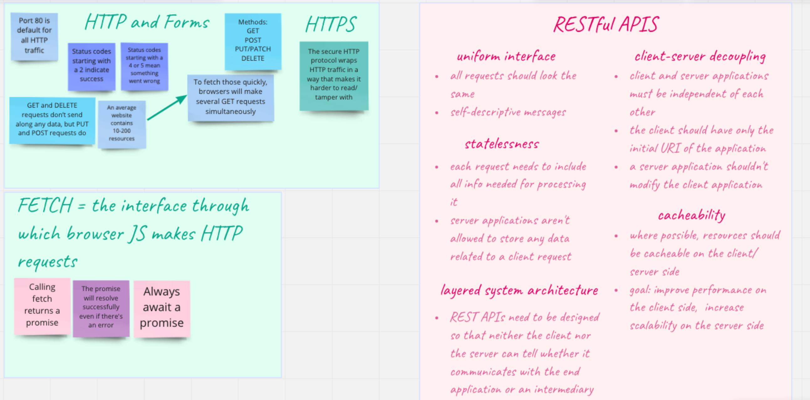
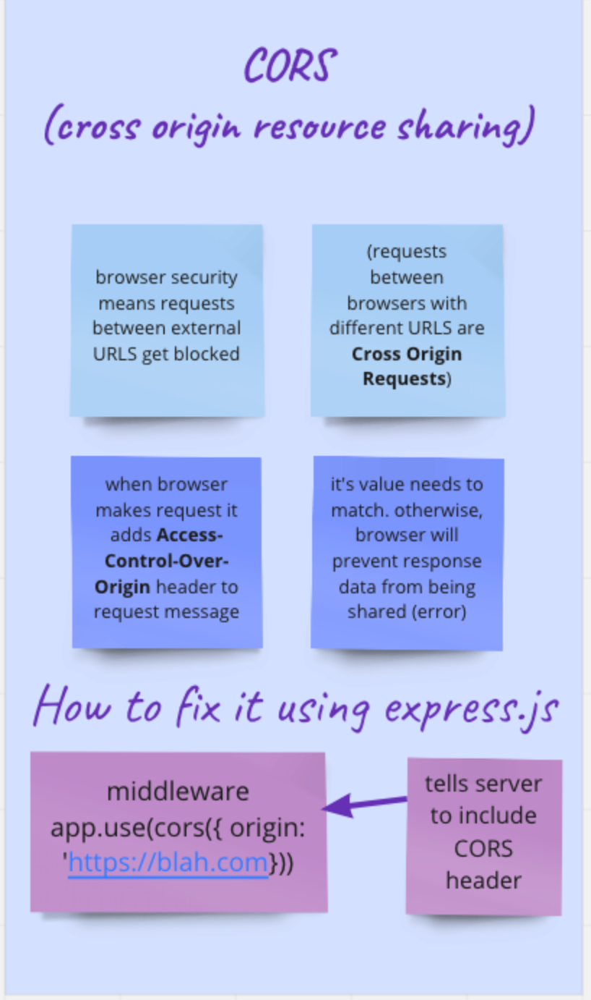

# 100DaysOfCode  
Journal of my 100 days of code  
  
So far I've been tracking my '100 days of code' on twitter, but have decided to do so on here too so that I can delve into more detail!  
I'm already up to day 17 (my favourite number!) so will continue from there onwards...  

**Day 17**  

Today I returned to the hackathon from Day 9 at school of code.  
We used an API to retrieve trivia questions, and create a simple quiz.  
Today I added a container and experimented with CSS to style it.

[Media Trivia Game:](https://github.com/KatieClarinet/Branch-of-fetch-hackathon---Trivia-Game)

**Day 18**

Some of our tasks today included experimenting with CSS variables, and working out how to add a 'night mode' toggle button.  
    
I've made a quick repo here to test my new skills: https://github.com/KatieClarinet/CSSVariables_ToggleDarkMode

**Day 19**

I've had a real 'everything going wrong' kind of day today. I thought I'd worked out how to add some game scores to the Music Trivia game, but my code isn't working - so I shall return to this with a fresh perspective in a day or so.  
  
At SoC today we were introduced to 'Coolors' website, so I have used a premade palette to jazz up the Music Trivia game. A small accomplishment, but hopefully lots of small improvements will add up to big ones soon.  

Here's the link: https://github.com/KatieClarinet/Branch-of-fetch-hackathon---Trivia-Game

**Days 20 and 21**

Yesterday I spent the evening at brum.js meeting some of my fellow SoC bootcampers, so I didn't do any coding after classes but I had a great experience!  
  
Today was the last day of UX/UI week at SoC and we had to design a business landing page. My partner and I opted for a 60s+ dating app and spent the day planning the web content. We went through the  following stages:  
- User stories  
- User personas  
- Research questions  
- Low fidelity wireframe  
- High fidelity wireframe  
- Writing a code plan  
  
This evening I decided to code the page and here's where I've got to:  
  
https://github.com/KatieClarinet/CatchLandingPage  
  
I still need to center the text in the footer boxes and tweak a few things, but it's the best CSS work I've done so far, and acheived in just a few hours so that's progress!  
  
  **Day 22**  
  
*Weekend Soc Tasks*  
The task this weekend is to put our new UX/UI skills into practice and research, design and code a Portfolio page. I used Miro to start a basic plan, then created a survey using Google Forms which I've sent out to as many devs as I can. I'll check how many responces I have tomorrow then continue my planning based on survey responses.  

*Rock Paper Scissors Game*  
It's been really bugging me that I never fixed my RPS game so that it tracks the amount of 'wins/losses/draws'. I watched a JavaScript tutorial on YouTube on how to create the RPS game and followed along. The tutorial doesn't show how to track the score (which I realised once I got to the end of the tutorial!) but, I actually worked out how to do it anyway. So here it is (it's just html and JS, no CSS yet): [Rock Paper Scissors Game](https://github.com/KatieClarinet/RockPaperScissors)  

*Music Trivia Game*  
I went back to my Trivia Game to work on how to track the score and spent a long time playing around with various ways to increment the scores. Eventually I took a piece of paper and drew a map of where I want each function/loop/button to lead, and then drew out a map of what my code was actually doing. I realised that I had all three buttons calling the same function (oops!) and that my code was not in the right order. Happy to say this is now fixed and the game score works!
[Music Trivia Game](https://github.com/KatieClarinet/Branch-of-fetch-hackathon---Trivia-Game)

**Day 23**

I continued with the SoC weekend task. Using the data from my survey I created user stories and personas. I made an inspiration board and had a think about what I liked most: bold colours and minimalist designs! I then created low fi and high fi wireframes (the hi fi is a work in progress).  
  
  **Day 24**  
    
This morning I coded my website, copying my High Fideluty Wireframe [My Website](https://github.com/SchoolOfCode/w3_recap-task-KatieClarinet)  
It's pretty simple at the moment but I will add to it once I have some projects ready.  

  At SoC today we did the W3 tests for HTML, CSS and JavaScript and I scored 77%, 88% and 88% respectively. We then had an introduction to Node and made sure we had it installed. We wrote a few functions using node rather than the browser, which was a new experience!  
  I'm currently a bit confused on how to export/import on node so will return to work on this tomorrow.  

**Day 25**

Today we used node to access the Express package and learned how to write a (very simple!) server. I don't have much to show for today's work, but I know have a much deeper understanding of how APIs work. Hopefully will build something in the next few days that I can link here.  

**Day 26**  

We learned about using Express today, including how to make seperate routers:
- a router that listens for a specific id
- a router that searches by text (we used the includes method for this).  

Notable thing(s) I learned:
- when using 'params' remember these are always a string. So, if you need your data to be treated as a number you will need to use JavaScript 'number' to wrap and convert to a number.  

This evening I read up on RESTful APIs and created a revision board on miro. 
  

**Day 27**  

This morning we continued our learning of Express and used the GET and POST methods to view/add to our data (an array of books). We used an API called postman rather than our browser.  

In the afternoon we split into groups and researched various aspects of Express. In my group we looked at 'Validating input with Express'. A summary:
- Express-validator provides access to a huge selection of pre-made functions which allow you to (from server side) validate and sanitise the requests of the user/client
- it checks that the input data is in the expected format and type
- it removes unsafe characters from user input
- this provides defense against attacks  

**Day 28**

We had a hackathon today where we created a RESTful API using all CRUD routes. My pair were successful with this but I feel like my knowledge is still pretty shaky so I'm hoping to research these methods/routes a lot more! Our weekend tasks are along the same vein but with some bonus tasks to link up to the front end - so hopefully I can solidify my knowledge with these... stay tuned.  

**Day 29**  

Having a rest day today so I haven't coded anything. In preparation for Kyle Simpson doing a talk at SoC on Monday I have watched his 'Keep Betting on JavaScript' talk from 2019 (which you can find on YouTube). The main takeaway I have is that, although, as a developer, we will work in small chunks, it's important to always keep the bigger picture in mind and think of the future implications of what we are building. There are a bunch of things he mentioned that I need to research (including, but not limited, to: eval, JQuery and strictmode). I really liked his emphasis on 'embracing what people can do' (emphasis on 'can') and his focus on making the web accessible, particularly by making pages work offline. I think I need to look into caching to understand more about how this is achieveable.  

I've been back to my revision board and added a list of things I need to recap from this week: (error handling in express, rate limiting, Using HTTP status codes, Validating input with express, Evolution of HTTP, Cybersecurity, Code formatting: Prettier and ES Lint). These are all topics we split into groups to research on Thursday (my group researched Validating Input with Express) but I think I need to take the time to do some personal research on each as I can tell they are all important! Today I looked into CORS and added a page to my revision board.  

**Day 30**  

Finished off the weekend recap test, which was similar to the Friday hackathon. Created a REST API with CRUD routes (create, read, update and delete) using a nested array of users as data source. Started bonus task, which was to start 'seperation of concerns' by using functions which then get imported into router. Got quite confused with middleware. Hoping to learn more this week!  

**Day 31**  

Returned to the bonus tasks from the weekend recap tasks and successfully implemented all of the model functions! We also had Kyle Simpson's talk today, which centered around 'Imposter Syndrome'.
I learned:
- 'If you wait until you're an expert, you've waited too long'. Meaning, it's better to show your work to others whilst you're on the journey of learning/creating. Their feedback will be handy!
- 'Sometimes doing is the best way to learn'
- 'Don't let lack of experience hold you back'.  

**Day 32**  

After a brief introduction to SQL yesterday, today we started working through the Interactive Tutorial on SQL Bolt and also some (much harder!) questions this afternoon. It's been such a fastpaced day that I need to take time to go back to the questions from this morning and take them at my own pace. I got as far as understanding how to JOIN more than one table together and access data, but everything else is still a mystery to me...  

**Day 33**  

Another jam-packed day of learning!  

Today we covered:
- creating up a Heroku account - we will now use this when setting up databases
- connecting our server to the database
- using pg package 
- using our new PostgreSQL skills to CREATE a new table and UPDATE it using data from our libs/data file 
- reconfigure our functions so that they interact with the database 
- enviroment variables (for telling express which port to listen to and to store our database connection details)
- about Pools and how to use them (still a bit shaky on this)  
  
**Day 34**  

We went into a lot more detail on how to connect our server to the database (using different methods to consolidate this).

